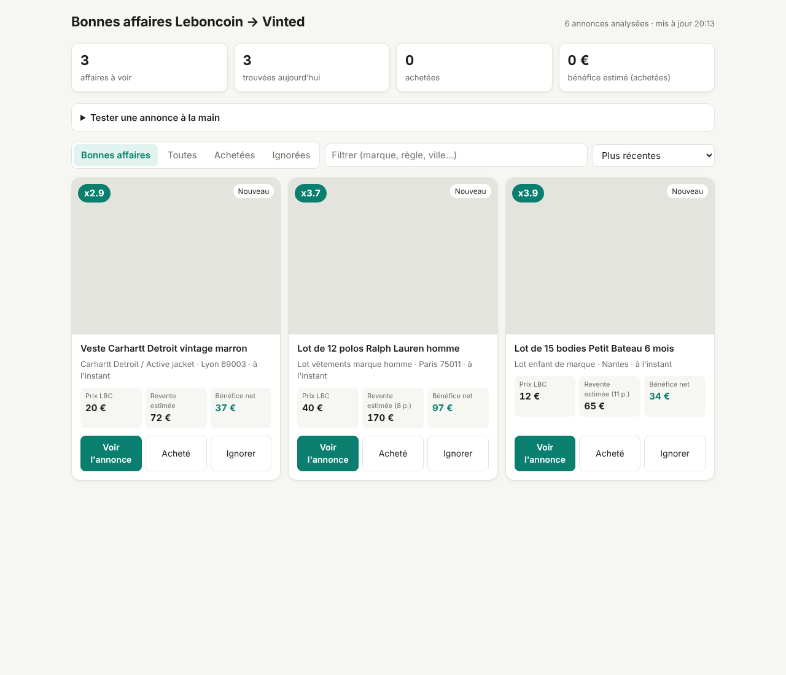

# Détecteur de bonnes affaires Leboncoin → Vinted

Le bot **trouve** les annonces Leboncoin sous-cotées et les affiche sur une **page web**, avec le multiplicateur et le bénéfice net estimés. Telegram reste possible en option. **Il n'achète rien** : c'est vous qui décidez et qui contactez le vendeur.

Il ne fait **aucune requête sur Leboncoin**. Il lit seulement les **emails d'alerte** que Leboncoin vous envoie pour vos recherches sauvegardées. Il ne risque donc ni blocage ni problème de conditions d'utilisation.

```
Alertes Leboncoin (email) ──► lecture IMAP ──► règles + cote ──► calcul du multiplicateur ──► page web (+ Telegram)
```



## Version Windows (.exe) : le plus simple

1. Téléchargez **ChasseurAffaires.exe** : https://github.com/DexscreenerAI/vinted.github.io/releases/latest/download/ChasseurAffaires.exe
2. Mettez-le dans un dossier à vous (ex. `Documents\Chasseur`), puis double-cliquez dessus.
   - Si Windows affiche « Windows a protégé votre ordinateur », cliquez sur **Informations complémentaires**, puis **Exécuter quand même** (le programme n'est pas signé).
3. La page s'ouvre toute seule dans le navigateur. Entrez votre boîte mail dans **Réglages** et cliquez sur **Tester la connexion**.
4. Le bouton **Mes niches & prix** ouvre `config.yaml` dans le Bloc-notes. Vos modifications sont prises en compte sans redémarrer.
5. Laissez la fenêtre noire ouverte : la fermer arrête le bot.

Le .exe est reconstruit automatiquement par GitHub (onglet *Actions*) à chaque modification du dossier `bot/`.

## Installation (avec Python)

```bash
cd bot
pip install -r requirements.txt
cp config.example.yaml config.yaml   # vos niches et vos prix de revente
cp .env.example .env                 # accès email + Telegram
```

### 1. Créer les alertes sur Leboncoin
Avec un compte Leboncoin dont l'email est la **boîte dédiée** :
1. Faites une recherche ciblée, triée par « plus récentes » (ex. `carhartt detroit`, `lot ralph lauren`, `north face nuptse`, `lot petit bateau`, `snes`).
2. Cliquez sur « Sauvegarder la recherche » et activez les **alertes email**.

Une alerte par règle de `config.yaml` est un bon début.

### Autres alertes email
Le bot lit aussi les alertes de trois autres sites, envoyées à la **même boîte dédiée**. Le site est reconnu d'après l'expéditeur. Les autres emails de la boîte ne sont pas touchés et restent non lus.

| Site | Créer l'alerte | Coût d'achat compté |
|---|---|---|
| **eBay** (ebay.fr, ebay.de) | Faites la recherche, triez par « Nouvelles annonces », puis cliquez sur **« Enregistrer cette recherche »** (cœur à côté des résultats) et cochez la réception par **email** dans *Mon eBay › Recherches enregistrées*. | prix + port s'il figure dans l'email, sinon le calcul habituel |
| **Interenchères** | Créez un compte, faites une recherche par mots-clés, puis cliquez sur **« Créer une alerte »** et choisissez la réception par email (*Mon compte › Mes alertes*). | estimation basse (ou mise à prix) + **28 % de frais acheteur**, transport en plus |
| **Kleinanzeigen.de** | Faites la recherche, cliquez sur **« Suchauftrag speichern »** et activez les **E-Mail-Benachrichtigungen** (*Meins › Suchaufträge*). « 45 € VB » (prix à négocier) est lu comme 45 €. | le calcul habituel |

Pour les ventes Interenchères, la date de la vente est affichée comme fin d'enchère quand l'email la donne. Les frais acheteur changent d'une maison de vente à l'autre : vérifiez-les dans les conditions de la vente avant d'enchérir.

**À vérifier sur un vrai email** : ces trois lecteurs ont été écrits sans exemple réel d'email, en restant tolérants. Dès que vous recevez la première alerte d'un site, enregistrez-la (Gmail : *⋮ › Télécharger le message*, fichier `.eml`) et testez :
```bash
python -m finder parse alerte-ebay.eml   # affiche le site, le prix, le titre, le coût et la fin d'enchère
```
Si des annonces manquent ou si les prix sont faux, signalez-le avec l'email.

Réglages facultatifs dans `.env` : `IMAP_SINCE_DAYS` (ne lire que les non-lus des N derniers jours, 7 par défaut) et `IMAP_FROM` (expéditeur supplémentaire, par exemple si vous transférez vos alertes depuis une autre adresse : le site est alors deviné d'après les liens).

### 2. Boîte mail
Gmail : activez la validation en 2 étapes, puis créez un **mot de passe d'application** et mettez-le dans `IMAP_PASSWORD`.

### 3. Telegram (facultatif)
1. Créez un bot avec **@BotFather** et récupérez son token.
2. Envoyez-lui un message.
3. Récupérez votre identifiant de chat avec **@userinfobot**.

Sans Telegram, les résultats sont seulement sur la page web.

### 4. Source eBay (facultatif)
Le bot peut aussi chercher sur **eBay.fr** via l'**API officielle Browse** (gratuite, aucun scraping).
1. Créez un compte gratuit sur **developer.ebay.com** (avec votre compte eBay), puis ouvrez *Application Keys*.
2. Créez un jeu de clés **Production** (pas *Sandbox*).
3. eBay demande de gérer les *Marketplace account deletion notifications* avant d'activer les clés : choisissez l'**exemption** (« I do not persist eBay data »). Le bot ne stocke aucune donnée d'utilisateur eBay, seulement les annonces.
4. Collez l'**App ID** (Client ID) et le **Cert ID** (Client Secret) dans la page : **Réglages → eBay**.

Chaque règle donne deux recherches, en France uniquement et sous `max_buy` : les annonces à prix fixe les plus récentes, et les enchères qui finissent dans les 3 heures avec 0 à 2 offres. La requête est déduite des mots-clés (`all` + premier `any`) ; on peut la fixer avec `search:` et ajouter des fautes courantes avec `variants: [carhart detroit]`.

Le quota gratuit est d'environ 5 000 appels par jour : le bot fait au plus 4 recherches toutes les 2 minutes, chaque recherche revient toutes les 30 minutes (`EBAY_INTERVAL_MIN`), plus si le nombre de règles l'exige, et jamais plus de 4 000 recherches par jour. Le coût d'achat compte le port et les **frais de Protection acheteurs** eBay (0,10 € + 7 % jusqu'à 20 €, 4 % jusqu’à 300 €, 2 % jusqu’à 4 000 €) pour les vendeurs particuliers, en vigueur depuis le 1er septembre 2026. Variables facultatives : `EBAY_MARKETPLACE` (`EBAY_FR`), `EBAY_COUNTRY` (`FR`).

## La page des résultats

```bash
python -m finder                        # comme le .exe : ouvre la page sur http://localhost:8000
python -m finder web                    # version serveur (VPS, Railway…), page accessible depuis l'extérieur
```

Cette commande fait deux choses en même temps : elle lit les alertes email toutes les 2 minutes (`--loop 120`) et elle sert la page.

Sur la page, vous pouvez :
- **voir les bonnes affaires** avec la photo, le prix Leboncoin, la revente estimée, le bénéfice net et le multiplicateur ;
- les trier (plus récentes, meilleur multiplicateur, plus gros bénéfice) et les filtrer par marque ou par ville ;
- marquer une affaire **Achetée** ou **Ignorée**, ce qui alimente le compteur de bénéfice, puis **Vendue** (voir « Mes ventes ») ;
- l'onglet « Toutes » montre aussi les annonces qui correspondent à une règle mais ne sont pas assez rentables ;
- **tester une annonce à la main** : collez un titre et un prix ;
- **Vérifier maintenant** : relance la lecture des emails sans attendre les 2 minutes. Les emails d'alerte sont lus même s'ils ont déjà été ouverts (7 derniers jours), sans être traités deux fois. Un email qui n'a pas pu être lu est enregistré dans `email_illisible_<site>.html` (dossier du bot) pour diagnostic ;
- **Analyser les pages — extension Chrome (automatique)** : bouton « Analyser les pages » → « Télécharger l'extension », extraire le zip, puis `chrome://extensions` → Mode développeur → « Charger l'extension non empaquetée » → dossier `chasseur-extension`. Ensuite, chaque page de recherche Leboncoin, Vinted ou eBay ouverte est analysée toute seule : badge « 🔥 x3,1 · +46 € » sur les annonces rentables et encadré récapitulatif (le logiciel doit être lancé ; aucune requête vers les sites, l'extension lit la page affichée) ;
- **🤖 Avis IA automatique (Claude Haiku)** : avec une clé API Claude, chaque bonne affaire est analysée (photo + annonce) avant d'apparaître et d'être notifiée : bon modèle ? état très bon ou neuf (réglage `etat_minimum`) ? contrefaçon ? vraie valeur ? Les affaires jugées « à éviter », en mauvais état ou mal identifiées restent dans « Toutes ». Environ 0,05 centime par avis, plafond quotidien réglable dans Réglages ;
- **État** : les titres qui annoncent un défaut (taché, abîmé, rayé, état moyen…) sont écartés, sauf négation (« sans tache ») ;
- **🤖 Avis IA** (à la demande) : sur chaque affaire, Claude analyse la photo et l'annonce (bon modèle ? signes de contrefaçon ? état ? revente réaliste ?) et répond « À acheter », « À vérifier » (avec les questions à poser au vendeur) ou « À éviter ». Nécessite une clé API Claude (console.anthropic.com, payant à l'usage : environ 2 à 5 centimes par avis), à coller dans Réglages → Claude (IA). L'avis est gardé : il n'est payé qu'une fois par annonce ;
- **▶ Lancer ma tournée** : le bouton principal ouvre les 10 meilleures recherches une par une (Leboncoin, ou les 3 sites à la suite pour chaque article). L'extension analyse chaque page ; « Recherche suivante ▶ » dans l'encadré ou **Alt+Maj+→** passe à la suivante (Alt+Maj+← revient). À la fin : bilan « N bonnes affaires → Voir ». L'extension peut rappeler la tournée à 9 h et 18 h (désactivable dans sa fenêtre) ;
- **Démarrer en 3 étapes** : au premier lancement, une liste qui se coche toute seule (extension connectée, première tournée faite, emails d'alerte reçus) remplace l'ouverture des Réglages. L'extension est prête à charger dans le dossier `chasseur-extension` créé à côté du .exe ;
- **Recherche suivante ▶ (semi-automatique)** : dans l'encadré de l'extension sur Leboncoin, Vinted ou eBay (ou dans sa fenêtre), chaque clic ouvre la recherche de l'article suivant de la liste (mots-clés, prix max, plus récentes ; les 10 meilleurs d'abord), et la page est analysée toute seule. C'est vous qui cliquez : l'extension ne navigue jamais seule ;
- **Analyser une page (favori)** : les alertes email n'envoient que les *nouvelles* annonces. Pour celles déjà en ligne, glissez le bouton « 🔎 Analyser la page » dans la barre de favoris, faites une recherche sur **Leboncoin, Vinted ou eBay** et cliquez dessus : le bot évalue toutes les annonces de la page (aucune requête vers ces sites, il lit seulement la page ouverte). Sur Vinted, le coût d'achat inclut la protection acheteur (0,70 € + 5 %) et ~3 € d'envoi ;
- **🔔 Activer les alertes** : une notification Windows et un son à chaque nouvelle bonne affaire, plus un compteur dans le titre de l'onglet. Il suffit que la page reste ouverte, même en arrière-plan. Telegram n'est plus nécessaire.

La page se met à jour toute seule chaque minute.

### Mes ventes : les vrais prix
Les `ref_price` de départ sont des estimations. En notant ce que vous vendez vraiment, le bot apprend vos prix réels :
- dans l'onglet **Achetées**, le bouton **Vendu** demande le prix de vente (et les frais éventuels : port non remboursé, boost…). L'affaire passe dans **Vendues** avec son bénéfice réel ;
- un article acheté en dehors du bot s'ajoute avec **+ Ajouter une vente** (titre, règle, prix d'achat, prix de vente) ;
- l'onglet **Mes ventes** affiche le bénéfice réel total (vente − achat − frais − 13,4 % − emballage), le nombre de ventes, le bénéfice moyen et le délai moyen entre l'achat et la vente ;
- le tableau par règle compare le **prix vendu médian** (par pièce pour un lot) à la cote de `config.yaml`. Dès **3 ventes**, le bouton **Mettre à jour la cote** remplace le `ref_price` de cette règle par la médiane arrondie à l'euro. Seule cette ligne de `config.yaml` est modifiée (commentaires conservés) et la nouvelle cote est prise en compte sans redémarrer.

Comme les réglages, l'enregistrement des ventes et la mise à jour de la cote ne sont possibles que depuis le PC du bot, ou avec `ADMIN_PASSWORD`.

**Page publique** : avec `python -m finder web`, la page est consultable par tout le monde, mais les **réglages** (boîte mail, Telegram) ne sont modifiables que depuis la machine du bot, ou avec `ADMIN_PASSWORD`. Pour cacher toute la page, définissez `WEB_PASSWORD`.

## Autres commandes

```bash
python -m finder run                    # traite les nouvelles alertes une fois
python -m finder run --loop 120         # tourne en continu (toutes les 2 min)
python -m finder check "Lot de 10 polos Ralph Lauren" 40              # évaluer une annonce à la main
python -m finder check "Doudoune North Face Nuptse" 45 --main-propre
python -m finder parse alerte.eml       # tester l'extraction sur un email sauvegardé (tous les sites)
```

Exemple d'alerte :
```
🔥 Lot de 10 polos Ralph Lauren
Règle : Lot vêtements marque homme
Prix LBC : 40 € → coût d'achat 46.20 €
Revente estimée : 128 € (6 pièces vendables)
Multiplicateur : x2.8 · bénéfice net ≈ 61 €
```

## Comment le score est calculé

| | |
|---|---|
| Coût d'achat | prix + 0,70 € + 5 % + port (ou prix seul si `--main-propre` / `hand_delivery: true`) |
| Revente estimée | `ref_price` × 0,85 (les prix vendus sont plus bas que les prix affichés) × pièces vendables |
| Lots | nombre de pièces lu dans le titre (« lot de 12 »), × `sellable_rate` (65-75 % vendables) |
| Bénéfice net | revente − 13,4 % (URSSAF + formation + versement libératoire) − emballage − coût d'achat |
| Alerte si | multiplicateur ≥ `min_ratio` (2,5) **et** bénéfice net ≥ `min_profit` (15 €) **et** prix ≤ `max_buy` |

## Les articles surveillés
`config.example.yaml` contient **64 articles précis**, classés par catégorie : vêtements de travail et streetwear vintage, chaussures, lots, rétrogaming, cartes Pokémon, Lego, lunettes, montres, photo argentique.

Leurs prix de revente sont **prudents**. Les seuls vrais prix de vente trouvés (environ 3 000 ventes d'un revendeur) sont 1,5 à 3 fois plus bas que les cotes des blogs.

Règle d'or : on ne surveille jamais une marque seule (elle se vend 20-30 €), toujours un modèle précis.

Les lignes marquées « données minces » sont à vérifier sur Vinted avant de leur faire confiance. Chaque affaire affichée sur la page a un lien **« Vérifier les prix sur Vinted »** pour contrôler en un clic.

## Régler `config.yaml`
- `ref_price` est **le chiffre le plus important**. Au début, c'est une estimation (voir `docs/etude-niches-arbitrage.md`). Ensuite, mettez-y le prix médian de **vos ventes réelles**.
- `all`, `any` et `none` sont les mots-clés de la règle : tous doivent être présents, au moins un doit l'être, aucun ne doit l'être. Dans `all`, une liste `[n64, nintendo 64]` veut dire « l'un ou l'autre ». Les accents, les majuscules et la ponctuation sont ignorés : `xt-6`, `XT6` et `xt 6` sont reconnus pareil.
- `exclude` élimine les annonces douteuses (« style carhartt », « replica », etc.).

## Lancer en continu
- Sur un petit VPS, un Raspberry Pi ou Railway : `python -m finder web` (la page + la lecture des emails). Le port est lu dans la variable `PORT` si elle existe.
- Les emails d'alerte traités sont marqués comme lus (les autres restent non lus), et les annonces déjà vues sont mémorisées dans `finder.db`.

## Tests
```bash
python -m unittest discover -s tests
```
